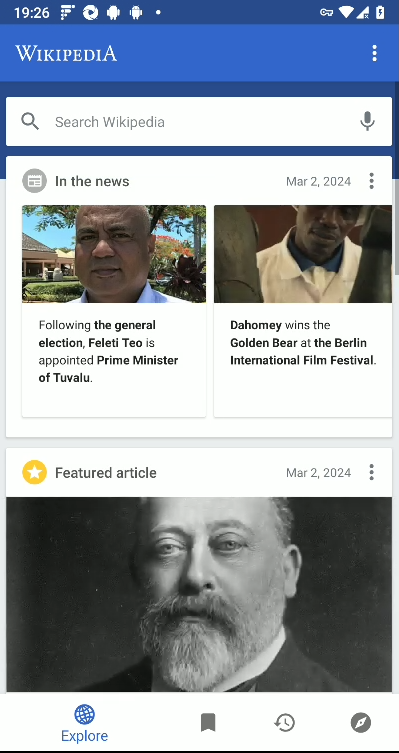
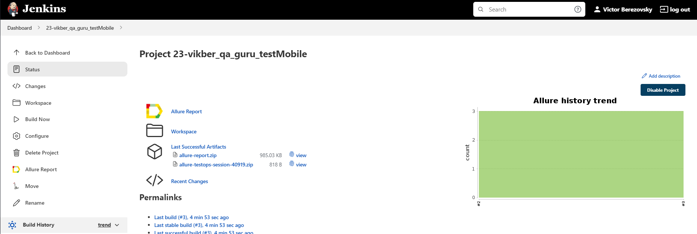
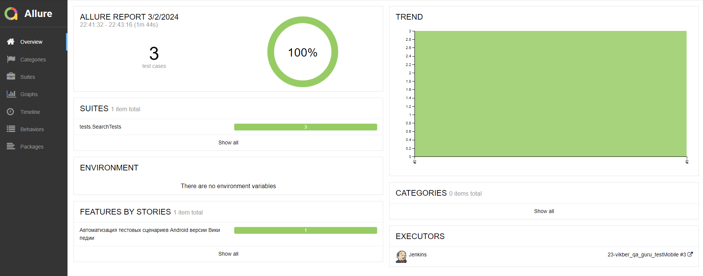
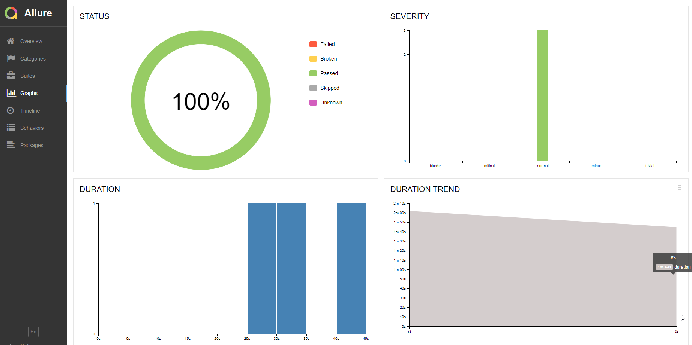
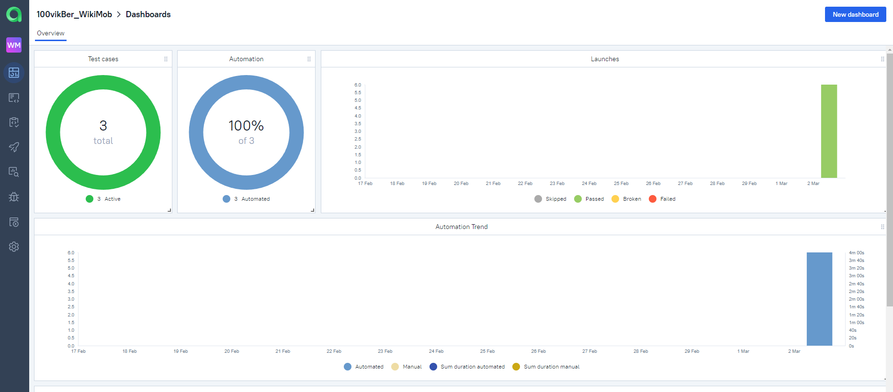
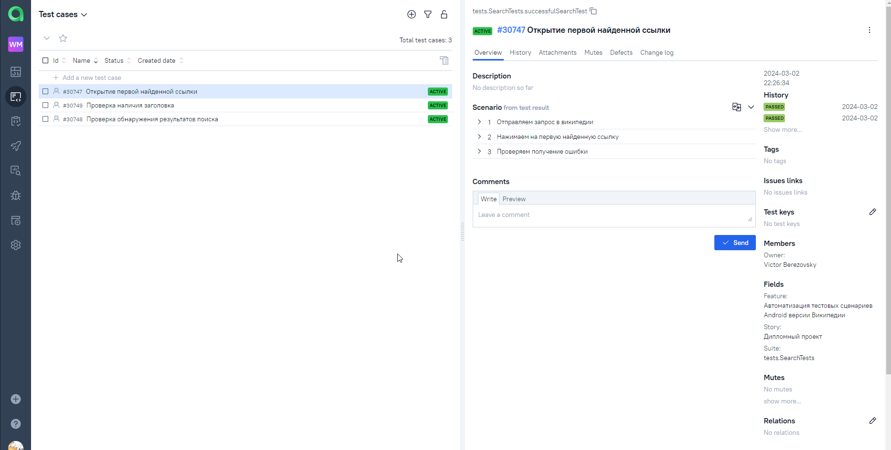
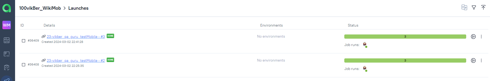
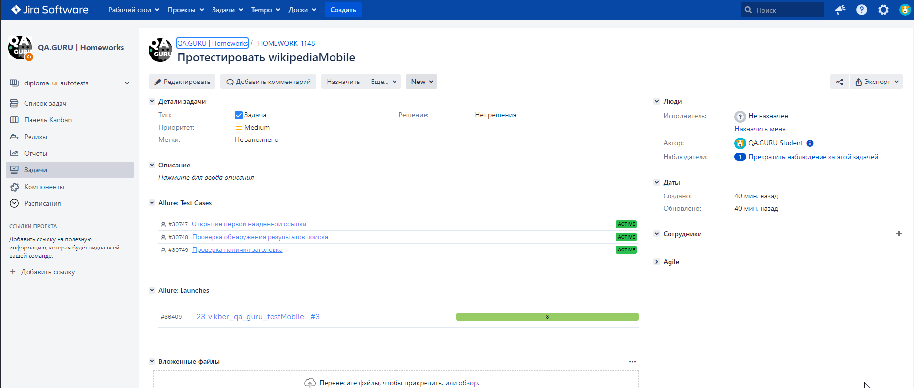
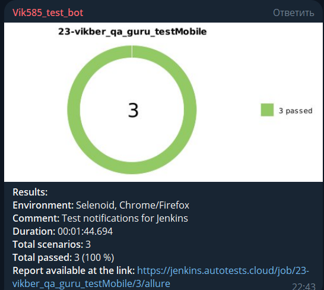
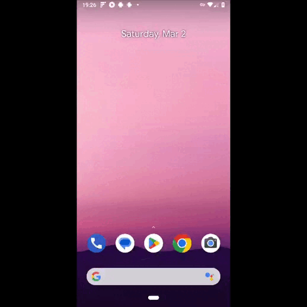

# Проект по автоматизации тестирования для мобильной версии [Википедии](https://ru.wikipedia.org/wiki/%D0%97%D0%B0%D0%B3%D0%BB%D0%B0%D0%B2%D0%BD%D0%B0%D1%8F_%D1%81%D1%82%D1%80%D0%B0%D0%BD%D0%B8%D1%86%D0%B0) 




<p>
Википе́дия (англ. Wikipedia) — общедоступная многоязычная универсальная интернет-энциклопедия со свободным контентом, реализованная на принципах вики. Википедия является международным проектом, который состоит из языковых разделов. Все языковые разделы объеденены общим принципами (см Пять столпов, могут отличаться в некоторых деталях. В Википедии нет национальных или государственных разделов: все участники того или иного раздела объеденены общим языком, хотя географически или политически могут находиться на территории или в юрисдикции любой страны. Таким образом, страница, которую вы читаете, является частью международного многоязычного проекта, которая написана на русском языке участниками из разных стран.
 </p>

##  Содержание:

- <a href="#tools"> Используемые инструменты</a>
- <a href="#cases"> Тест-кейсы</a>
- <a href="#autotests"> Запуск автотестов</a>
- <a href="#jenkins"> Сборка в Jenkins</a>
- <a href="#allureReport"> Пример Allure-отчета</a>
- <a href="#allure"> Интеграция с Allure TestOps</a>
- <a href="#jira"> Интеграция с Jira</a>
- <a href="#tg"> Уведомления в Telegram с использованием бота</a>
- <a href="#video"> Видео примера запуска тестов в Browserstack</a>

____
<a id="tools"></a>
## Используемые инструменты

<p align="center">
<a href="https://www.java.com/"></a>
<a href="https://appium.io/docs/en/2.4/"></a>
<a href="https://www.browserstack.com/"></a>
<a href="https://github.com/allure-framework/allure2"></a>
<a href="https://qameta.io/"></a>
<a href="https://gradle.org/"></a>
<a href="https://junit.org/junit5/"></a>
<a href="https://github.com/"></a>
<a href="https://www.jenkins.io/"></a>
<a href="https://web.telegram.org/a/"></a>
<a href="https://www.atlassian.com/ru/software/jira/"></a>
</p>

____
Тесты написаны на языке <code>Java</code> с использованием фреймворка для автоматизации мобильного тестирования [Appium](https://selenide.org/), сборщик - <code>Gradle</code>.

<code>JUnit 5</code> задействован в качестве фреймворка модульного тестирования.
При прогоне тестов для удаленного запуска используется [Browserstack](https://aerokube.com/selenoid/).

Для удаленного запуска реализована джоба в <code>Jenkins</code> с формированием Allure-отчета и отправкой результатов в <code>Telegram</code> при помощи бота.
Также реализована интеграция с <code>Allure TestOps</code> и <code>Jira</code>.


Содержание Allure-отчета для каждого кейса:
* Шаги теста и результат их выполнения
* Скриншот страницы на последнем шаге (возможность визуально проанализировать, почему упал тест)
* Page Source (возможность открыть source страницы в новой вкладке и посмотреть причину падения теста)
* Логи консоли браузера
* Видео выполнения автотеста.
____
<a id="cases"></a>
## :male_detective: Тест-кейсы
Auto:
- ✓ Проверка обнаружения результатов поиска
- ✓ Поиск нужного определения
- ✓ Проверка наличия заголовка в новостях

Manual:
- ✓ Проверка успешного перехода в тело новости по ссылке
  
  <a id="autotests"></a>
  <a id="manual"></a>
____
## :arrow_forward: Запуск автотестов

### Запуск тестов из терминала

Локальный запуск.
Из корневой директории проекта выполнить:
```
gradle clean test  запуск всех тестов
```
____
<a id="jenkins"></a>
##  </a> Сборка в <a target="_blank" href="https://jenkins.autotests.cloud/job/23-vikber_qa_guru_testMobile/"> Jenkins </a>
Сборка доступна в [Jenkins](https://jenkins.autotests.cloud/)


Для запуска сборки необходимо перейти в раздел <code>Build Now</code>, и нажать кнопку <code>Build</code>.

</p>
<p>После выполнения сборки, в блоке <code>Build History</code> напротив номера сборки появятся значки <code>Allure Report</code> и <code>Allure TestOps</code>, при клике на которые откроется страница с сформированным html-отчетом и тестовой документацией соответственно.</p>

____
<a id="allureReport"></a>
##  </a> Пример <a target="_blank" href="https://jenkins.autotests.cloud/job/23-vikber_qa_guru_testMobile/allure/"> Allure-отчета </a>


<p align="center">

</p>

## 📊 Графики Allure
<p align="center">

</p>

____

<a id="allure"></a>

<a id="allure"></a>
##  </a> Интеграция с <a target="_blank" href="https://allure.autotests.cloud/project/3903/dashboards"> Allure TestOps </a>

На *Dashboard* в <code>Allure TestOps</code> видна статистика количества тестов: сколько из них добавлены и проходятся вручную, сколько автоматизированы. Новые тесты, а так же результаты прогона приходят по интеграции при каждом запуске сборки.

<p align="center">

</p>

## 📑 Тест-кейсы



## 🚀 Запуски


____
<a id="jira"></a>
##  </a> Интеграция с <a target="_blank" href="https://jira.autotests.cloud/browse/HOMEWORK-1099"> Jira </a>

Реализована интеграция <code>Allure TestOps</code> с <code>Jira</code>, в задаче отображается, какие тест-кейсы были написаны в рамках задачи и результат их прогона.

<p align="center">

</p>

____

<a id="tg"></a>

##  Уведомления в Telegram с использованием бота

После завершения сборки, бот, созданный в <code>Telegram</code>, автоматически обрабатывает и отправляет сообщение с отчетом о прогоне тестов в специально настроенный чат.

<p align="center">

</p>

----

<a id="video"></a>

##  Видео примера запуска тестов в Browserstack

В отчетах Allure для каждого теста прикреплен не только скриншот, но и видео прохождения теста

<p align="center">
  
</p>
